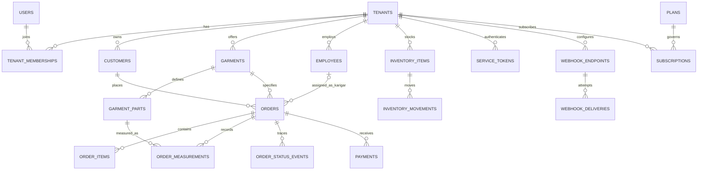

# Target Architecture and Data Model

## Decisions

- Phase 1 uses Laravel 11+ REST API, Nuxt 3 SSR, MySQL 8, Redis, Horizon, Reverb and S3-compatible storage.
- Tenancy is shared database/shared schema. Every tenant-owned aggregate has `tenant_id`; automatic scopes and route-binding checks are mandatory.
- Use bigint primary keys internally. Public API identifiers use non-sequential ULIDs (`public_id`) to avoid enumeration while retaining efficient local joins.
- Mobile numbers are stored normalized in E.164 form and uniquely indexed per tenant.
- Money uses integer minor units and a three-letter currency code.
- Orders use a validated state machine: `measuring -> pending_assignment -> in_progress -> ready -> delivered`; cancellation is a guarded terminal path.
- External voice systems receive one revocable hashed service token per tenant. Tokens carry abilities and rate limits.

## Bounded modules

Identity & Tenancy; Customers; Catalog & Measurements; Orders & Production; Inventory & Purchasing; Sales & Accounting; Workforce; Notifications & Integrations; Billing; Reporting; Super Admin.

## ER diagram

## Core schema

All tenant tables include timestamps; mutable business entities use `deleted_at`. Foreign keys are indexed. `tenant_id` is the leading column on tenant-local uniqueness and common filters.

| Table | Important columns and constraints |
|---|---|
| `tenants` | `id`, `public_id`, `name`, `slug` unique, `status`, `default_locale`, `currency` |
| `users` | `id`, `public_id`, `name`, `email` unique, `password`, `two_factor_*` |
| `tenant_memberships` | `tenant_id`, `user_id`, `role`; unique pair |
| `customers` | `tenant_id`, `public_id`, `name`, `mobile_number`, `address`, `created_via`; unique (`tenant_id`,`mobile_number`) |
| `employees` | `tenant_id`, `public_id`, optional `user_id`, `name`, `mobile_number`, `employee_type`, `pay_type`, `active` |
| `garments` | `tenant_id`, `public_id`, `name`, `slug`, `active`; unique (`tenant_id`,`slug`) |
| `garment_parts` | `tenant_id`, `garment_id`, `public_id`, `name`, `slug`, `unit`, `display_order`, `svg_asset_ref`, `required`; unique (`garment_id`,`slug`) and (`garment_id`,`display_order`) |
| `orders` | `tenant_id`, `public_id`, `order_number`, `customer_id`, `garment_id`, nullable `karigar_id`, `status`, `created_via`, `promised_at`, `ready_at`, `delivered_at`, totals; unique (`tenant_id`,`order_number`) |
| `order_items` | `tenant_id`, `order_id`, `catalog_item_id`, `quantity`, unit price, discount, total |
| `order_measurements` | `tenant_id`, `order_id`, `garment_part_id`, decimal `value`, `unit`, `entered_via`, `entered_at`; unique (`order_id`,`garment_part_id`) |
| `order_status_events` | `tenant_id`, `order_id`, `from_status`, `status`, actor type/id, `note`, `created_at`; append-only |
| `payments` | `tenant_id`, `order_id`, `amount_minor`, `currency`, `method`, `reference`, `received_at`, actor |
| `inventory_items` | `tenant_id`, `public_id`, `sku`, `name`, `unit`, reorder level; unique (`tenant_id`,`sku`) |
| `inventory_movements` | `tenant_id`, item, type, signed quantity, unit cost, reference type/id, reason, actor, occurred_at; append-only |
| `service_tokens` | `tenant_id`, name, token hash, abilities JSON, last used, expires/revoked timestamps |
| `webhook_endpoints` | `tenant_id`, URL, signing secret ciphertext, subscribed events, active |
| `webhook_deliveries` | tenant, endpoint, event ULID, attempt, response status, error, next retry, delivered timestamp |
| `plans` | code, name, price minor, currency, interval, feature limits JSON, active |
| `subscriptions` | tenant, plan, provider IDs, status, trial/end/grace timestamps |

## Key indexes

- Orders: (`tenant_id`,`status`,`promised_at`,`id`), (`tenant_id`,`customer_id`,`id`), unique order number.
- Customers: unique normalized mobile; (`tenant_id`,`name`,`id`). Add a generated/search column or external search only after measured need.
- Measurements: unique order/part; (`tenant_id`,`order_id`).
- Status events: (`tenant_id`,`order_id`,`created_at`,`id`).
- Inventory movements: (`tenant_id`,`inventory_item_id`,`occurred_at`,`id`).
- Webhook deliveries: (`status`,`next_retry_at`) for workers and unique (`event_id`,`endpoint_id`,`attempt`).

## Tenant enforcement

HTTP middleware resolves a tenant from subdomain and confirms membership/token ownership. `BelongsToTenant` adds a global Eloquent scope and assigns `tenant_id` on create. Nested route binding verifies the complete parent chain. Queue payloads carry a tenant identifier and workers establish/clear tenant context around each job. Super-admin access uses explicit audited impersonation, never `withoutGlobalScopes()` in ordinary services.

## Legacy migration mapping

| Legacy | Target |
|---|---|
| `company` | `tenants` plus typed settings |
| `user` | `users`, `tenant_memberships`, `employees` |
| `customer` | `customers` |
| `dsms` | `orders`, `order_status_events`, notification history |
| `order_record` | `order_items` and production assignments |
| product/property tables | catalog, `garments`, `garment_parts` |
| accounting/transaction/update_due | invoices, payments and ledger entries |
| direct sale tables | sales and sale items |
| stock/purchase records | inventory movements and purchase receipts |
| wages tables | work entries and payout batches |

The importer will use a `legacy_import_mappings` table keyed by source table/id so reruns update or skip deterministically. Each batch runs in a transaction, records checksums/counts, and never deletes target data.

## Real-time and webhook flow

1. A validated measurement upsert commits in a transaction.
2. An after-commit `MeasurementRecorded` event broadcasts on private `tenants.{tenant}.orders.{order}`.
3. Nuxt merges the keyed measurement into state; the SVG layer identified by `svg_asset_ref` updates.
4. Completion is calculated from required part IDs with a set difference, not a query per part.
5. A transition to `ready` appends a status event and dispatches `OrderReady` after commit.
6. A queued webhook job signs the body, retries with backoff and records every attempt.

## Known risks found in discovery

Raw SQL interpolation, manual tenant filters, obsolete password handling, generic arbitrary table updates, duplicated flags/dates, repeated scalar subqueries, synchronous external calls, and delimiter-encoded domain data are migration blockers. They are behavior references only and must not be ported literally.

